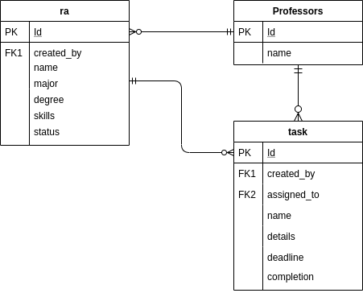

This project was made with NodeJS, using the Express and MySQL Bindings.
## Steps to run in your local machine

In the project directory, you can run:
### `npm install`
Installs all the dependencies from package.json 

### `npm start`

Runs the server and listens to requests in the development mode. 

## Database
The database configuration is not necessary. The MySQL database for the project is hosted remotely which I will keep running for at least 3 days since the submission date of this project. 
If you want to run the database in your own machine, configure creds.js using your database credentials. The table schema configurations can be done by importing db_tables_schema.sql file into the database of your local machine.
 
#### Database Structure
 

